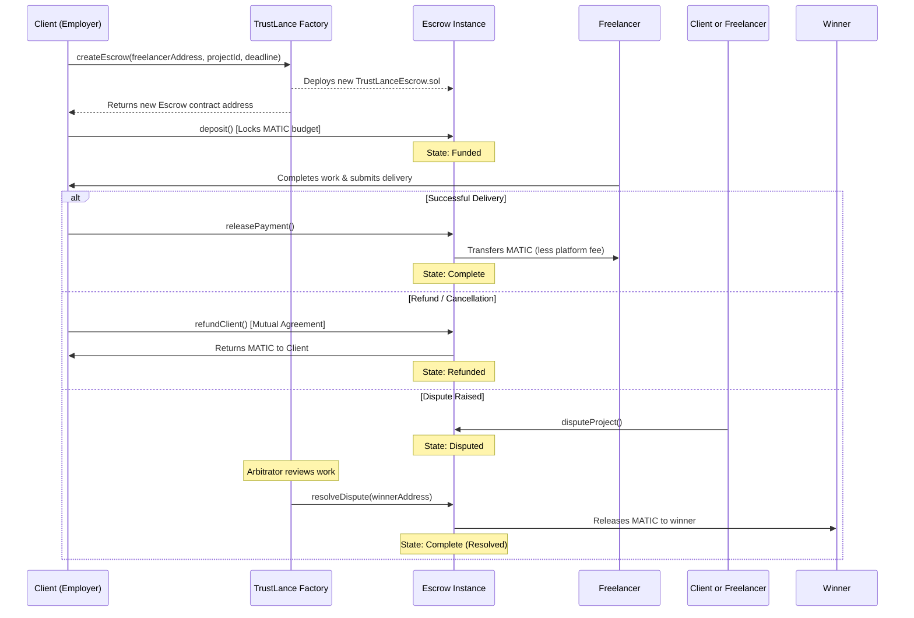

# 🛡️ TrustLance — Decentralized Web3 Freelance Marketplace

> A secure, decentralized freelance marketplace built on the Polygon blockchain. TrustLance protects clients and freelancers using smart-contract-based escrow accounts — locking payments until milestones are met, with built-in dispute resolution.


## 🌐 Live Demo
👉 **[https://trustlance-red.vercel.app](https://trustlance-red.vercel.app)**

## 📜 Deployed Contracts (Polygon Amoy Testnet)
- **Escrow Factory Address:** [`0xfBbB6CcB83a5D15752c336ACc1F0a29158fF8a59`](https://amoy.polygonscan.com/address/0xfBbB6CcB83a5D15752c336ACc1F0a29158fF8a59)
- **Network:** Polygon Amoy Testnet (Chain ID: `80002` / `0x13882`)

---

## 📸 Screenshots

*(Add your screenshots here to showcase your beautiful UI!)*

<table>
  <tr>
    <td align="center"><b>🔐 Connect Wallet</b></td>
    <td align="center"><b>🏠 Freelance Dashboard</b></td>
  </tr>
  <tr>
    <td></td>
    <td></td>
  </tr>
  <tr>
    <td align="center"><b>💼 Browse Projects</b></td>
    <td align="center"><b>📝 Create a Project</b></td>
  </tr>
  <tr>
    <td></td>
    <td></td>
  </tr>
  <tr>
    <td align="center"><b>🔒 Escrow Detail</b></td>
    <td align="center"><b>🔔 Notifications Panel</b></td>
  </tr>
  <tr>
    <td></td>
    <td></td>
  </tr>
</table>

---

## 🔄 How TrustLance Escrow Works



---

## ✨ Features

### 💼 Job Posting & Freelancer Onboarding
- **Post a Project**: Clients can post jobs specifying title, description, category, required skills, budget (in MATIC), and deadline.
- **Client & Freelancer Roles**: Secure sign-up and profile customization for both sides of the marketplace.
- **Explore Marketplace**: Browse projects with categories, filters, and search capabilities.

### 🔒 Decentralized Escrow Payment System
- **Escrow-per-Project**: Deploys an independent Solidity escrow smart contract for each hired freelancer.
- **Milestone Locking**: Client funds are locked in the escrow contract prior to project commencement, ensuring freelancers are guaranteed payment.
- **Multi-State Escrow**: Tracks payment state directly on the blockchain: *Awaiting Payment*, *Funded*, *Complete*, *Refunded*, and *Disputed*.
- **Fee Collection**: Integrates a configurable platform fee structure.

### ⚠️ Dispute Resolution
- **Raise Disputes**: If requirements are unmet or issues arise, either party can freeze funds and flag the project as disputed.
- **Arbitration Hook**: Admin/arbitrator can resolve disputes, transferring funds securely to the rightful winner.

### 🔔 Smart Notification Center
- Real-time UI alerts filtered by categories:
  - 📩 **Proposals**: Proposal received, accepted, or rejected.
  - 💰 **Payments**: Escrow created, payment deposited, payment released, or refunded.
  - ⚠️ **Disputes**: Dispute raised or resolved.
  - ⭐ **Reviews**: Feedback and ratings received.

### 📊 Client & Freelancer Dashboard
- **Custom Profiles**: Showcases bio, rating, portfolios, and wallet address.
- **Active Gigs Tracking**: Check current contract state, deadlines, and balances.
- **Export History**: Download full transaction logs.

---

## 🛠️ Tech Stack

| Layer | Technology | Description |
|---|---|---|
| **Frontend** | React.js / Next.js / Vite | Dynamic, single-page client interface |
| **Styling** | Tailwind CSS | Sleek, modern, and mobile-first layout |
| **Blockchain** | Polygon Amoy Testnet | Low gas fee EVM chain (Chain ID: `80002`) |
| **Smart Contracts**| Solidity, Hardhat | Escrow and Factory contract development |
| **Web3 Library** | Ethers.js v6 | Provider connections and contract execution |
| **Wallet Connector**| MetaMask / EVM Provider | Decentralized user wallet authentication |
| **Notifications** | Custom Context Hook | Multi-category client notifications system |
| **Icons** | Lucide React | Modern, customizable vector iconography |

---

## 🚀 Getting Started

### Prerequisites
- [Node.js](https://nodejs.org/) v22+
- [MetaMask](https://metamask.io/) browser extension configured for Polygon Amoy network.
- Some test MATIC from the [Amoy Faucet](https://faucet.polygon.technology/).

### Installation

1. **Clone the repository:**
   ```bash
   git clone https://github.com/Yashmihani/TrustLance.git
   cd TrustLance
   ```

2. **Install frontend and contract dependencies:**
   ```bash
   npm install
   ```

3. **Set up Environment Variables:**
   Create a `.env` file in the root folder:
   ```env
   VITE_CONTRACT_ADDRESS=0xfBbB6CcB83a5D15752c336ACc1F0a29158fF8a59
   ```

4. **Start local development server:**
   ```bash
   npm run dev
   ```
   Open your browser to `http://localhost:5173` (or the port specified by Vite).

---

## 📁 Repository Structure

```
src/
├── components/
│   ├── ConnectWallet.jsx      # MetaMask connection panel
│   ├── BottomNav.jsx          # Mobile navigation layout
│   ├── PageTransition.jsx     # Framer Motion transition wrapper
│   ├── Skeleton.jsx           # Loading placeholders
│   └── ...
├── pages/
│   ├── Home.jsx               # TrustLance landing page
│   ├── Explore.jsx            # Job marketplace browsing
│   ├── ProjectDetail.jsx      # Job details and proposal submission
│   ├── Dashboard.jsx          # Hub for active escrows, proposals & stats
│   ├── PostJob.jsx            # Client job posting page
│   ├── EscrowDetail.jsx       # Escrow contract deposit/release/refund action center
│   ├── ProfileSetup.jsx       # User onboarding/registration screen
│   ├── ProfileEdit.jsx        # Edit skills, bio, and portfolio
│   ├── Transactions.jsx       # Filterable log of transaction history
│   └── Notifications.jsx      # Tabbed panel for Proposals, Payments, Disputes
├── hooks/
│   ├── useWallet.js           # Wallet connection state and event listeners
│   └── useEscrow.js           # Ethers contract interface wrapper hooks
contracts/
├── TrustLanceEscrowFactory.sol # Factory contract for deploying individual escrows
└── TrustLanceEscrow.sol        # Project-specific escrow and payment processor
```

---

## 📜 Smart Contract Architecture & ABI

### 1. Escrow Factory (`TrustLanceEscrowFactory.sol`)
Responsible for deploying individual escrows for projects, establishing mapping records, and indexing user history.

```solidity
// Factory ABI Function Signatures
function createEscrow(
    address _freelancer, 
    string memory _projectId, 
    uint256 _deadline
) external returns (address);

function getProjectEscrow(string memory _projectId) external view returns (address);

function getUserEscrows(address _user) external view returns (address[]);

// Emitted Events
event EscrowCreated(
    address indexed escrowAddress, 
    address indexed client, 
    address indexed freelancer, 
    string projectId, 
    uint256 timestamp
);
```

### 2. Escrow Contract (`TrustLanceEscrow.sol`)
Holds project funds securely and manages the lifecycle of the freelance payment.

#### Escrow States:
- `0` - **Awaiting Payment**: Contract deployed, waiting for client deposit.
- `1` - **Funded**: Client deposited budget. Freelancer is safe to begin work.
- `2` - **Complete**: Client approved work; funds released to freelancer.
- `3` - **Refunded**: Client and freelancer cancelled; funds returned to client.
- `4` - **Disputed**: Project locked due to a disagreement; awaiting arbitrator decision.

```solidity
// Escrow ABI Function Signatures
function deposit() external payable;
function releasePayment() external;
function refundClient() external;
function disputeProject() external;
function resolveDispute(address _winner) external;

function getDetails() external view returns (
    address client, 
    address freelancer, 
    uint256 amount, 
    uint8 status, 
    string memory projectId, 
    uint256 deadline, 
    uint256 platformFee
);
function getBalance() external view returns (uint256);

// Emitted Events
event PaymentDeposited(address indexed client, uint256 amount, uint256 timestamp);
event PaymentReleased(address indexed freelancer, uint256 amount, uint256 platformFeeAmount, uint256 timestamp);
event PaymentRefunded(address indexed client, uint256 amount, uint256 timestamp);
event DisputeRaised(address indexed raisedBy, uint256 timestamp);
```

---

## 🔮 Roadmap / Future Enhancements

- [ ] **Arbitration DAO**: Transition from centralized arbitration to community-based jurors (Kleros style).
- [ ] **ERC-20 Support**: Allow payments in stablecoins (USDC/USDT) and other network tokens.
- [ ] **Reputation Badges**: Mint soulbound token (SBT) NFTs as freelancer review/rating certificates.
- [ ] **Encrypted Messaging**: Direct wallet-to-wallet decentralized chat (XMTP integration).
- [ ] **Account Abstraction**: Gasless transactions and social logins (ERC-4337) to simplify onboarding.

---

## 👨‍💻 Author

**Yash Mihani**
- GitHub: [@Yashmihani](https://github.com/Yashmihani)
- LinkedIn: [www.linkedin.com/in/yash-mihani-443624377](https://www.linkedin.com/in/yash-mihani-443624377)

---

## 📄 License

MIT License — feel free to use this project for learning, hacking, or portfolio showcases!

---

⭐ **If you like this decentralized marketplace project, please give it a star!**
